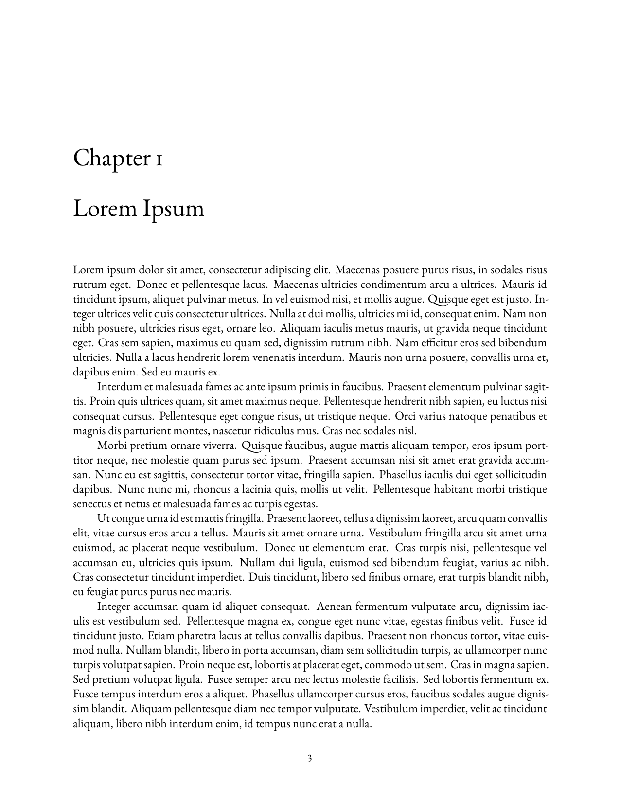
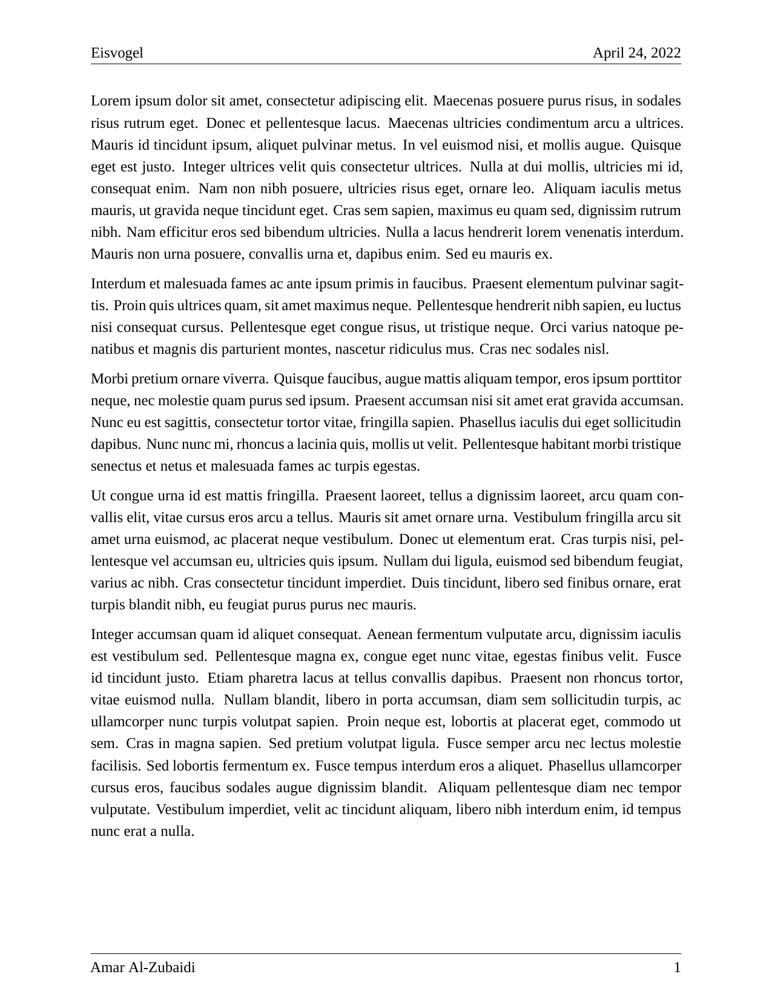
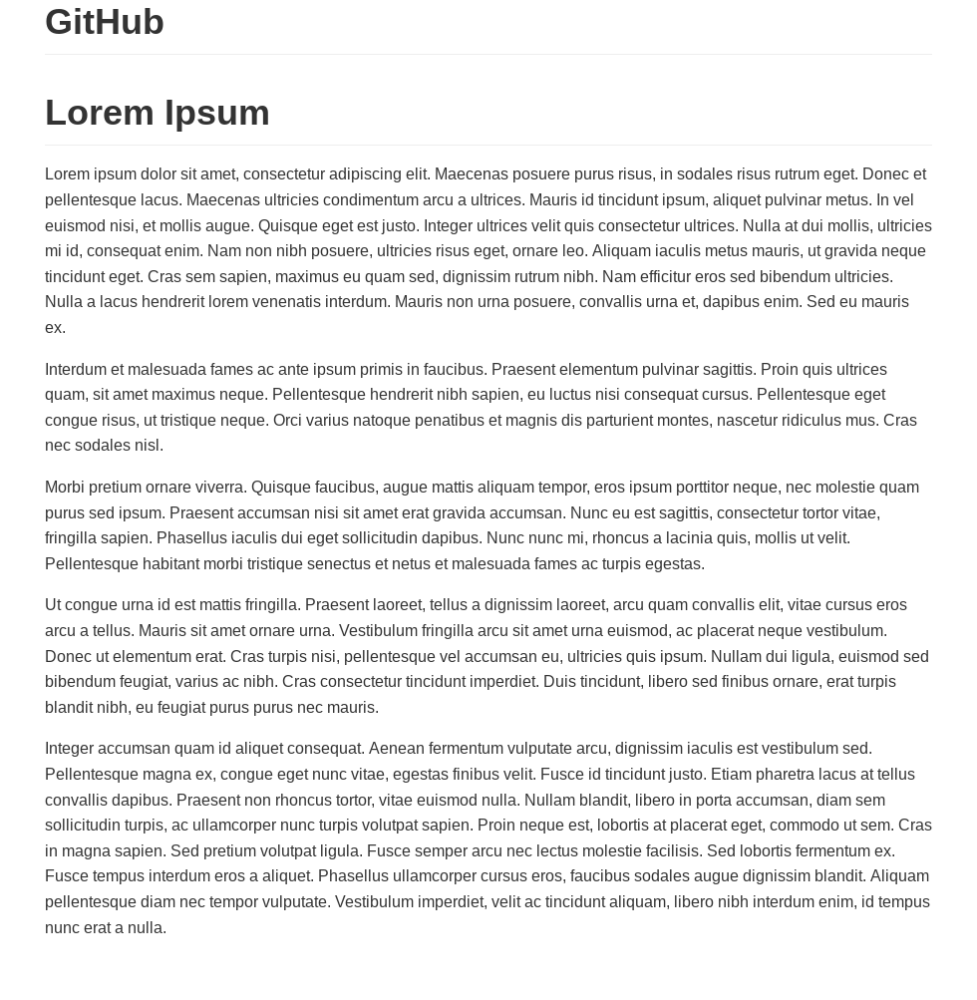
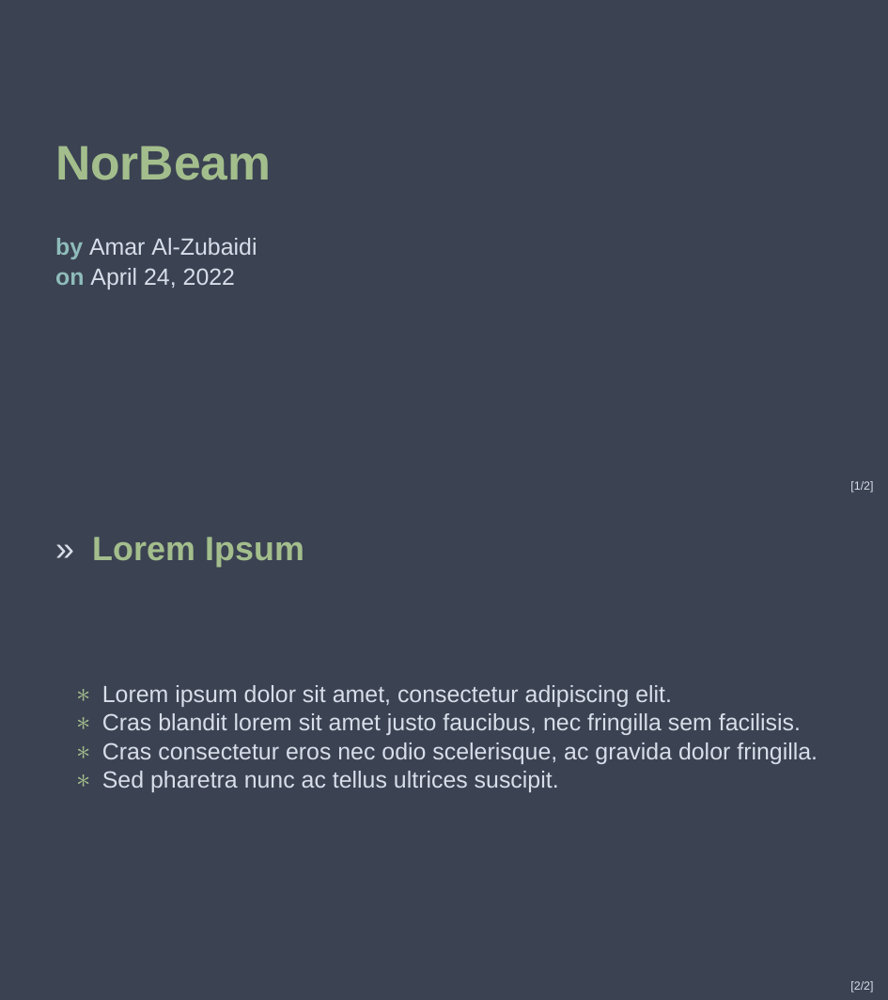

```{r setup, include = FALSE}
library(knitr)
opts_chunk$set(echo = FALSE, cache = TRUE)
```

# Description
R package which includes a suite of custom R Markdown templates. 
Most of these templates use LaTeX, GitHub is the exception.
These templates are useful due to them having common information in the YAML header.
They also include global R options that are helpful.
I use them so I don't have to define them each time I create a new R Markdown file.

# Templates
There are currently four templates available in this package:

```{r templates}
one = c("")
two = c("")

templates = data.frame(one, two)

kable(templates, 'pipe', align = 'cc', col.name = c("[Book](inst/examples/book/book.pdf)", "[Eisvogel](inst/examples/eisvogel/eisvogel.pdf)"))
```
```{r templates}
one = c("")
two = c("")

templates = data.frame(one, two)

kable(templates, align = 'cc', col.name = c("[GitHub](inst/examples/github/github.md)", "[NorBeam](inst/examples/norbeam/norbeam.pdf)"))
```

```{r templates}
one = c("![Brochure [1/2]](inst/examples/brochure/brochure-1.png)")
two = c("![Brochure [2/2]](inst/examples/brochure/brochure-2.png)")

templates = data.frame(one, two)

kable(templates, align = 'cc', col.name = c("[Brochure [1/2]](inst/examples/brochure/brochure.pdf)", "[Brochure [2/2]](inst/examples/brochure/brochure.pdf)"))
```

## GitHub

The GitHub template uses a pandoc lua filter script named `lower-header.lua`.
This simple script only occupies four lines of code.
Its purpose is to make each section header one level lower.
For example: level one headers (`#`) will be turned to level two headers (`##`), and so on.

# Installation
The *amaryaml* package is currently only available from GitHub.
You need the *remotes* package to install from GitHub:

```r
install.packages("remotes")
remotes::install_github("Amarakon55/amaryaml")
```

This package requires LaTeX for most templates.
The [*tinytex* package](https://github.com/yihui/tinytex) makes it easy to setup LaTeX within R:

```r
install.packages("tinytex")
tinytex::install_tinytex()
```

# Usage
Using *AmaRYAML* is very easy.
There are two main ways to do so:

1. selecting a template in RStudio using the R Markdown template selector
1. creating a new draft with the `rmarkdown::draft()` function

   - `rmarkdown::draft("file.Rmd", "book", "amaryaml")`
   - `rmarkdown::draft("file.Rmd", "eisvogel", "amaryaml")`
   - `rmarkdown::draft("file.Rmd", "github", "amaryaml")`
   - `rmarkdown::draft("file.Rmd", "norbeam", "amaryaml")`
