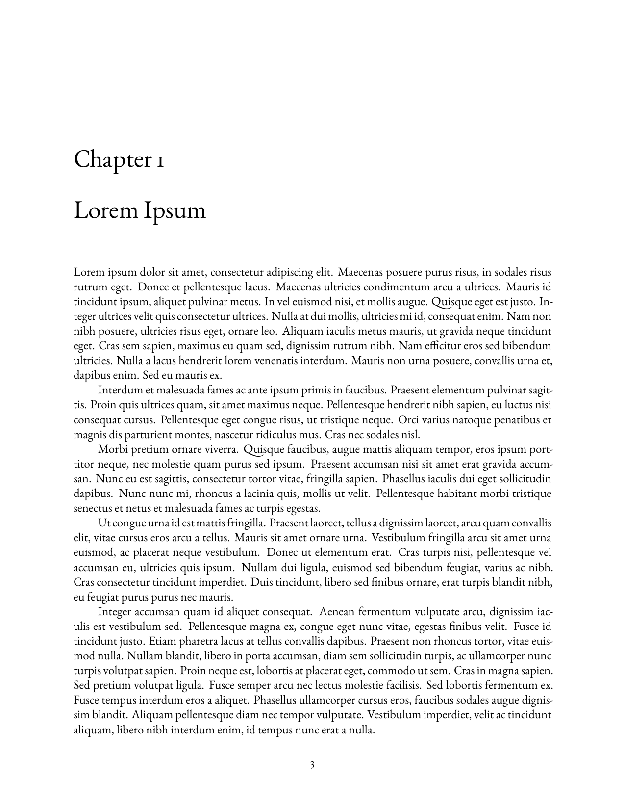
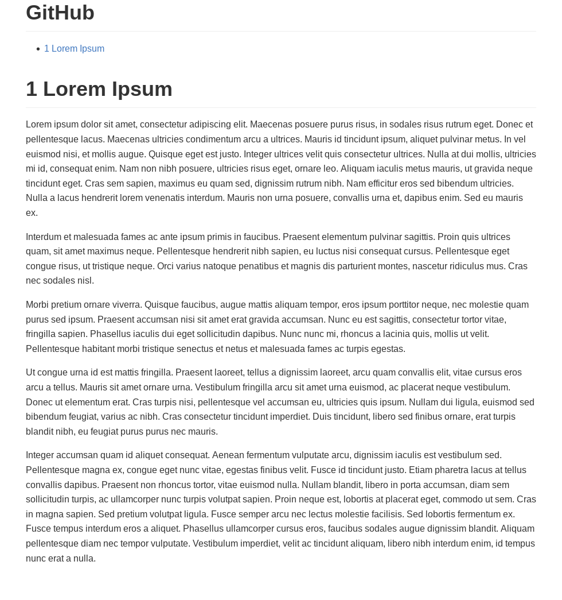
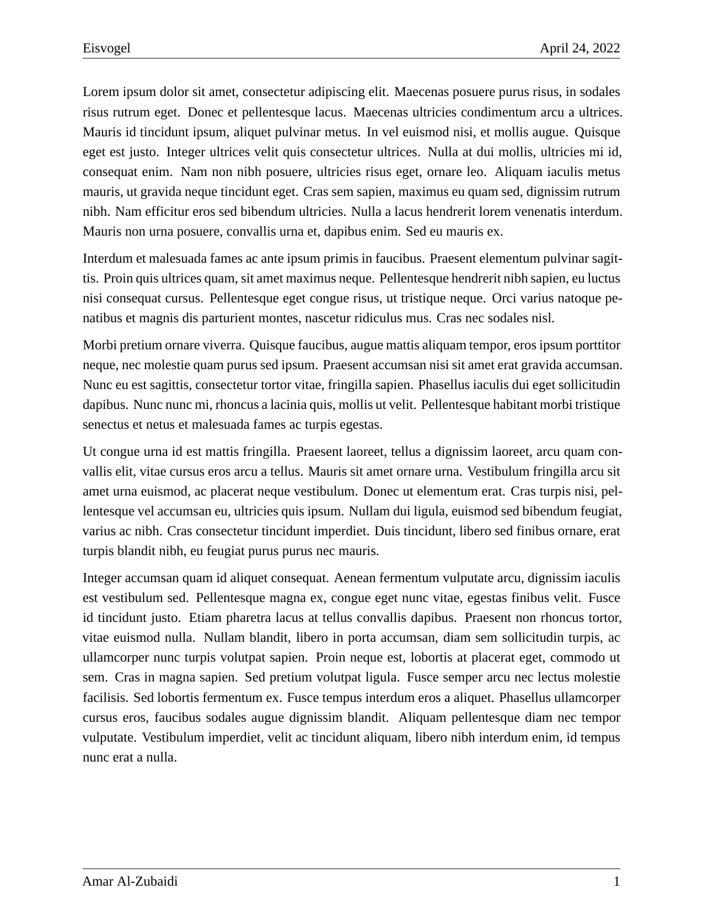
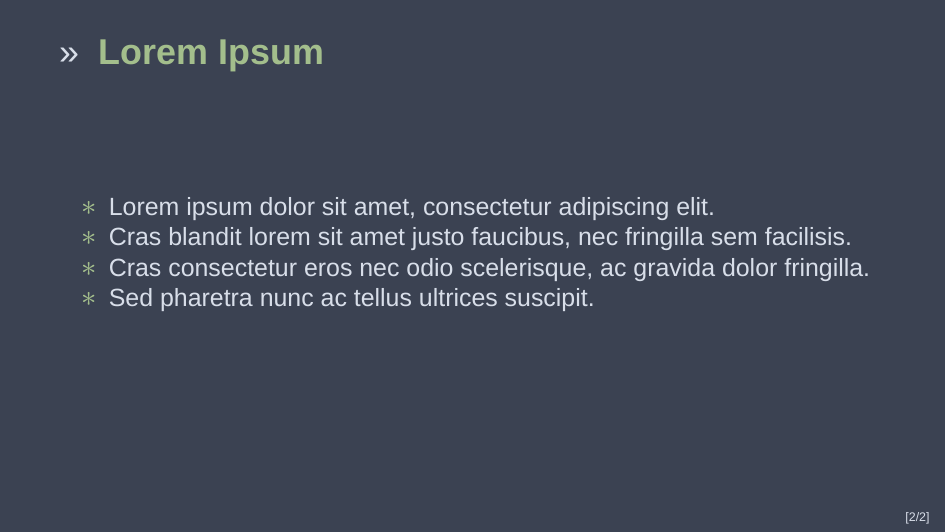

amaRYAML
================

## Description

R package which includes a suite of custom R Markdown templates. Most of
these templates use LaTeX, GitHub is the exception. These templates are
useful due to them having common information in the YAML header. They
also include global R options that are helpful. I use them so I don’t
have to define them each time I create a new R Markdown file.

## Templates

There are currently 4 templates available in this package:

|            Book             |             GitHub              |
|:---------------------------:|:-------------------------------:|
|  |  |

|              Eisvogel               |              NorBeam              |
|:-----------------------------------:|:---------------------------------:|
|  |  |

## Installation

The *amaRyaml* package is currently only available from GitHub. You need
the *remotes* package to install from GitHub:

``` r
install.packages("remotes")
remotes::install_github("Amarakon55/amaRyaml")
```

This package requires LaTeX for most templates. The [*tinytex*
package](https://github.com/yihui/tinytex) makes it easy to setup LaTeX
within R:

``` r
install.packages("tinytex")
tinytex::install_tinytex()
```

## Usage

Using *amaRyaml* is very easy. There are 2 main ways to do so:

1.  selecting a template in RStudio using the R Markdown template
    selector

2.  creating a new draft with the `rmarkdown::draft()` function

    -   `rmarkdown::draft("file.Rmd", "book", "amaRyaml")`
    -   `rmarkdown::draft("file.Rmd", "eisvogel", "amaRyaml")`
    -   `rmarkdown::draft("file.Rmd", "github", "amaRyaml")`
    -   `rmarkdown::draft("file.Rmd", "norbeam", "amaRyaml")`
